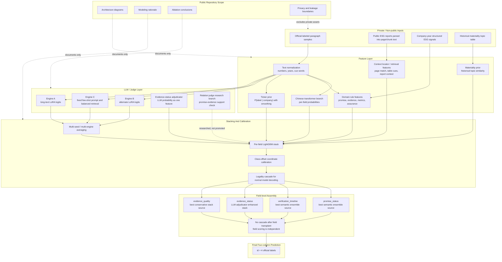
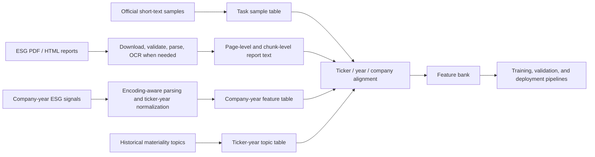
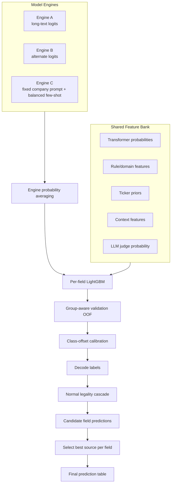
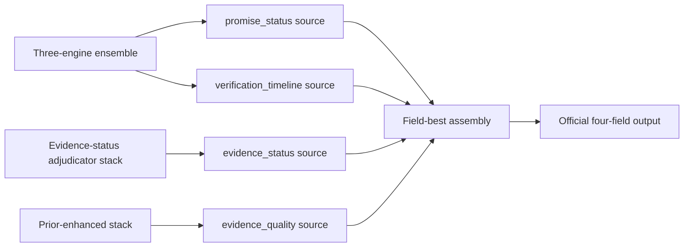
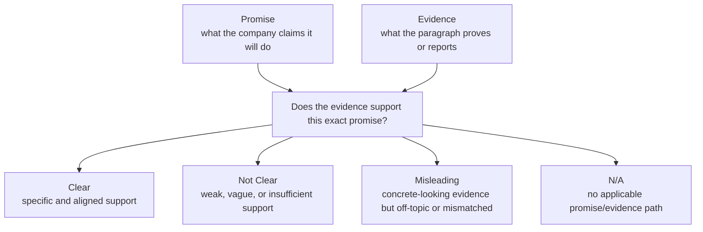
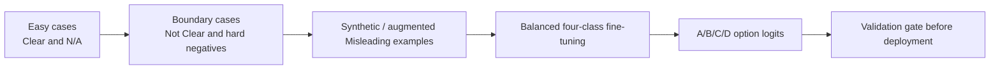
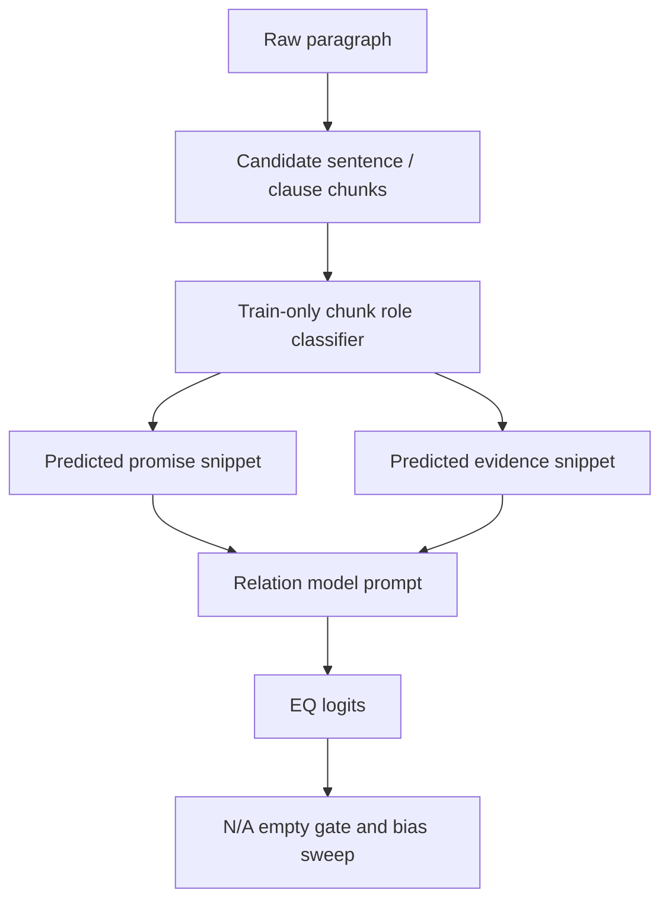
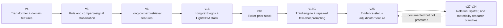

# ESG Promise Verification Competition Architecture

This repository is an architecture-only public summary of an ESG report
paragraph classification system.

It documents the modeling design, data-flow thinking, feature layers,
ensemble strategy, evaluation discipline, and later research branches. It does
not include the original competition data, commercial data exports, model
weights, private logits, generated submissions, notebooks with answers, API
keys, or scripts that directly reconstruct a submission.

## Current Architecture

The latest internal system is a field-level ensemble. It does not rely on one
large model to answer every label directly. Instead, it combines semantic
models, domain features, long-context signals, ticker priors, and LLM judge
probabilities, then assembles the strongest field source per target.



## Problem

The task predicts four fields for each ESG report paragraph:

- `promise_status`
- `verification_timeline`
- `evidence_status`
- `evidence_quality`

The hard part is not simple topic classification. The model must distinguish
whether a paragraph contains a promise, whether that promise has a timeline,
whether evidence exists, and whether the evidence actually supports the
promise.

This creates several technical pressures:

- Chinese ESG terminology is domain-specific.
- The labels are strongly imbalanced.
- The four fields have hierarchy-like dependencies.
- Evidence quality depends on relation judgment, not just keyword overlap.
- Full reports contain useful context, but blindly adding retrieval noise can
  hurt.

## Data Architecture

The private project keeps data in separate layers. The public repository only
describes the design.



The important design choice is separation. Official labels, long-report
context, structured company signals, and topic priors are not mixed in raw form.
They are normalized into feature tables before entering the model stack.

## Modeling Layers

### 1. Semantic Branch

A Chinese transformer branch produces per-field probabilities and compact
semantic signals. This branch handles paragraph-level language understanding:
promise wording, completion wording, vague future claims, and evidence-like
sentences.

### 2. Domain Feature Branch

Rule-derived features encode signals that are easy for humans to define but
easy for small neural models to miss:

- years and future deadlines
- percentages, quantities, monetary values, and KPI units
- assurance, verification, ISO, GRI, TCFD, and audit cues
- vague action verbs versus concrete measurable actions
- table-like and numeric-density signals

These features are not used as a hand-written classifier. They become inputs to
the fusion model.

### 3. Context And Retrieval Branch

Full ESG reports are parsed into page-level and chunk-level text. Retrieval
features estimate whether the paragraph is near a stronger supporting context
inside the same report.

This branch was useful mainly when its signal was field-specific. A broad
retrieval feature added to every task can dilute the existing stack, so the
architecture treats retrieval as a gated feature source.

### 4. Company Prior Branch

The competition samples share company identities across train, validation, and
test. The system therefore uses a smoothed company prior:

```text
P(label | ticker) + log(company_sample_count)
```

Validation priors are computed only from training labels, while deployment
priors can use all available labeled development data. This keeps validation
free from label leakage while preserving the legal deployment condition.

### 5. LLM Logit And Judge Branch

LLMs are used as structured feature generators, not as the only final decision
maker.

Two styles were tested:

- long-text engines that emit option probabilities for each task
- adjudicator models that answer a narrower question, such as whether evidence
  exists for a promise

The strongest promoted branch was the evidence-status adjudicator. It was added
as a probability feature to the existing stack rather than used as a direct
overwrite.

## Ensemble Logic



The final stage uses field-level assembly because public evaluation confirmed
that fields are scored independently. After transplanting the best source for
each field, the system intentionally does not re-apply the cascade; otherwise a
strong field can be damaged by a weaker field.

## Field-level Strategy



This is the main architectural lesson from the project: once field independence
is verified, improvements can be shipped one field at a time. A better
evidence-status model does not need to disturb promise, timeline, or evidence
quality.

## Evidence Quality Bottleneck

`evidence_quality` became the main bottleneck. The issue is that the hardest
class is not merely "unclear wording." It is a relation problem:



Several branches failed because they improved surface plausibility without
improving relation ranking:

- direct EQ specialists
- binary Clear versus Not Clear calibration
- generic RAG label distribution
- local 9B rubric judge
- relation LLM judge used as an overwrite
- pseudo-split relation training on test-like prompts
- broad materiality features

The conclusion was not "LLMs are useless." The more precise conclusion is:
for this dataset, evidence quality needs high-quality promise/evidence splits
and relation-contrastive supervision. Generic four-class training mostly learns
the cascade and majority shortcuts.

## REL9B Research Branch

The 9B relation model branch was designed to train a dedicated
promise-evidence relation judge with four official classes:

- Clear
- Not Clear
- Misleading
- N/A

The training design used curriculum ideas:



This branch produced useful research signal, but direct deployment was rejected
because validation gains did not transfer reliably when gold
`promise_string` / `evidence_string` splits were unavailable at test time.

## Automatic Splitter Research

Because test samples do not include gold promise/evidence strings, a splitter
probe was built to infer them from raw paragraphs.



The probe showed that the idea is not impossible, but the bottleneck is the
empty gate: rows without applicable promise/evidence must stay blank before the
relation model is called. Without that gate, the splitter fabricates snippets
and collapses N/A recall.

## Materiality Feature Branch

Historical materiality topics were tested as a company-topic prior:

- topic similarity between paragraph text and historical company materiality
  items
- E/S/G topic share
- recency and topic-importance statistics

This source had broad ticker coverage, but it mostly duplicated company prior
information. It is useful as a low-risk feature-bank asset, not as a standalone
breakthrough.

## Validation Discipline

The project used a strict promotion gate:

- every new feature must beat the existing stack on grouped validation
- field-specific gains are preferred over broad noisy changes
- public feedback is used to validate architecture, not to hand-edit answers
- branches that do not clear the gate are documented and stopped
- final assembly preserves the best known source for each independent field

This mattered because many attractive ideas produced local gains but failed
transfer:

- retrieval label distribution that duplicated ticker priors
- context features that helped one field but polluted others
- direct relation-model overwrites
- broad EQ recalibration
- materiality features as a full-stack add-on

## Version Evolution Summary



## Why Not End-to-end LLM?

The task has fixed labels, small data, severe class imbalance, and strict
field-level evaluation. A pure generative model creates problems:

- output-format instability
- expensive repeated inference
- weak calibration on minority classes
- difficulty separating cascade rules from relation judgment
- unreliable transfer when prompt inputs differ between validation and test

The final architecture therefore uses LLMs where they are strongest:
generating calibrated probabilities for narrow subquestions, then letting a
small supervised stack decide how much to trust them.

## Productization View

If turned into a production system, the architecture would become these
services:

- ingestion service: parse ESG reports and normalize paragraphs
- feature service: generate semantic, rule, context, and company-prior features
- judge service: run narrow LLM adjudicators for difficult subquestions
- inference service: run field-specific stacks and calibration
- review service: surface uncertain or relation-heavy cases for human audit
- evaluation service: track field-level F1, drift, and error patterns

## Public Repository Boundary

This repository intentionally excludes:

- raw competition data
- parsed ESG report text
- commercial or licensed data exports
- materiality tables and company-level private feature files
- trained checkpoints and adapters
- private logits, OOF tables, and generated submissions
- API credentials or remote training configuration
- scripts that directly rebuild the private submission

It keeps:

- architecture diagrams
- version rationale
- modeling trade-offs
- failure analysis
- privacy and leakage boundaries

The goal is to show the engineering structure and learning path without
publishing private competition assets.
