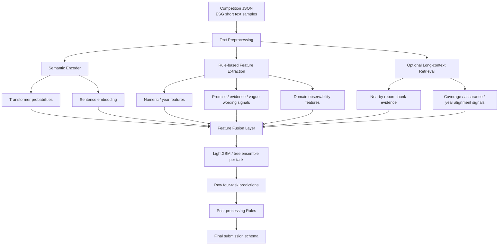
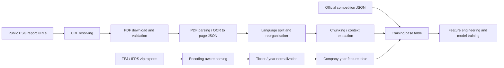
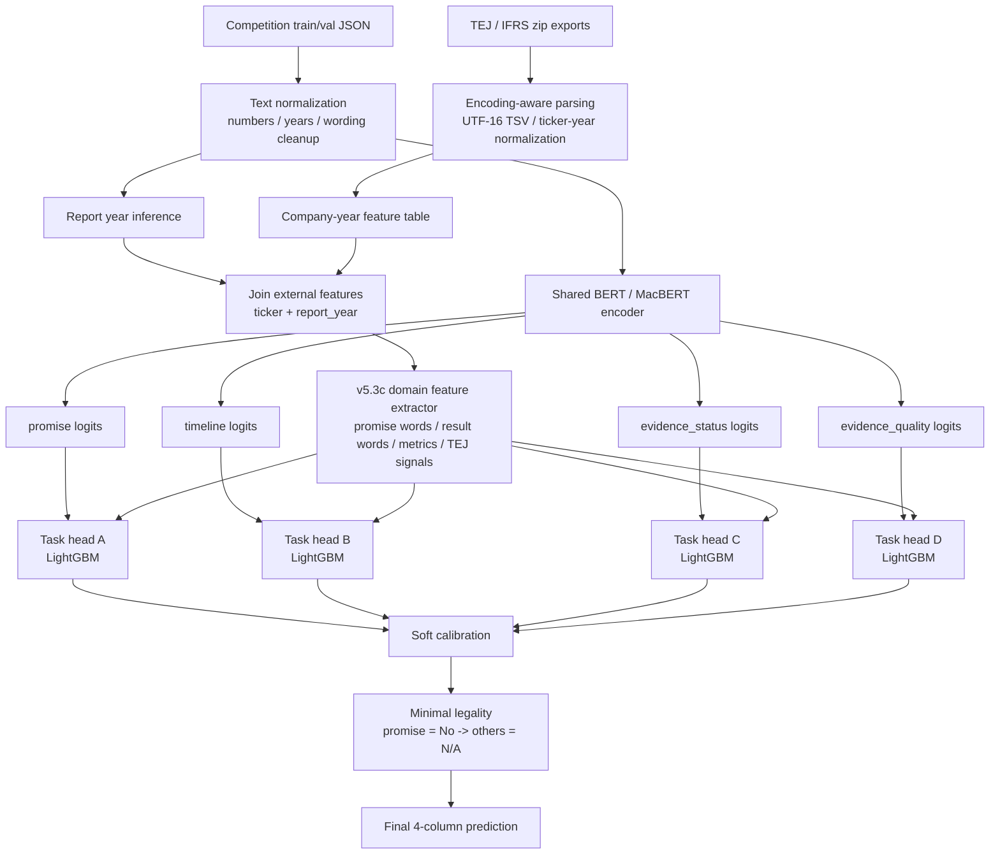
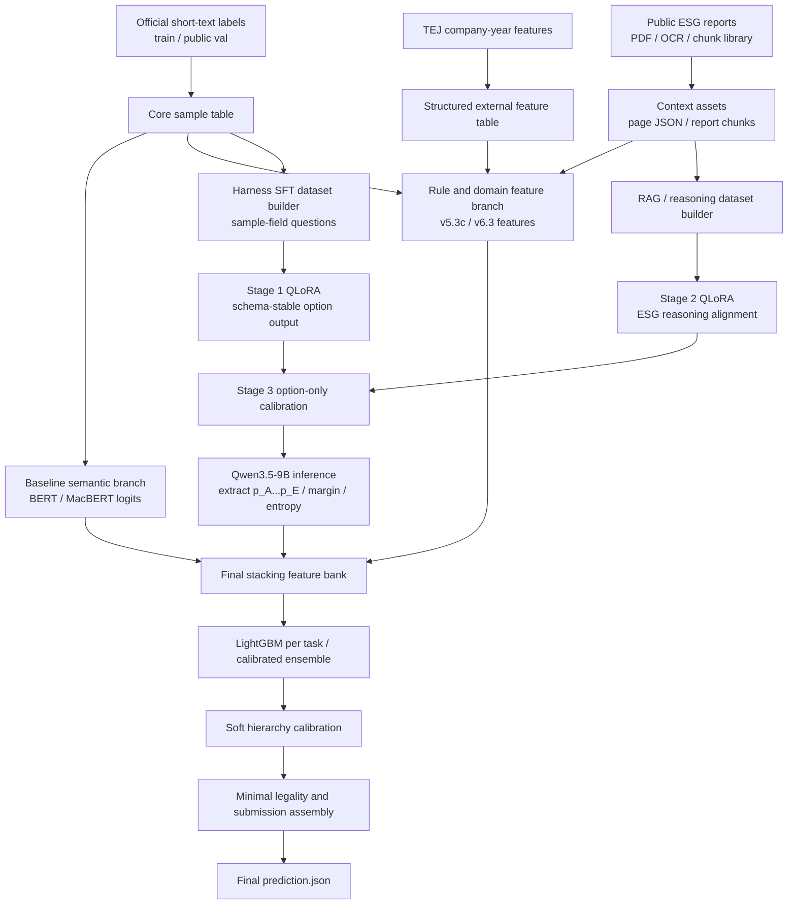

# ESG Promise Verification Competition

面試作品集整理版。

此版本只保留系統架構、方法設計、模組拆分與實驗演進，不包含競賽原始資料、外部商業資料、模型權重、私有訓練產物或可直接重建競賽提交的完整程式。

## 專案定位

這個專案的目標是處理 ESG 報告段落分類任務，針對單段文字預測四個欄位：

- `promise_status`
- `verification_timeline`
- `evidence_status`
- `evidence_quality`

核心挑戰不是一般情緒分類，而是要同時處理：

- 中文 ESG 專業語意
- 類別不平衡
- 多任務標籤依賴
- 證據充分性與漂綠風險判斷
- 短文本與長文本證據落差

## 架構目標

我把整體系統設計成「語意模型 + 規則特徵 + 表格模型融合 + 邏輯後處理」四層架構，原因是單一模型很難同時兼顧：

- 語意理解能力
- 少數類別穩定性
- 可解釋性
- 標籤邏輯一致性
- 對資料量偏小情境的泛化能力

## 系統總覽

## 內部工程分層

原始專案在內部是分層管理的，公開版只保留概念，不公開資料與腳本細節：

- `01_原始資料`：官方資料、baseline notebook、競賽規格
- `02_競賽說明`：實驗設計、版本策略、ablation 記錄、架構決策
- `03_人工註記`：錯誤分析、規則歸納、資料補標與質檢
- `04_Demo`：展示範例與 walkthrough
- `esg_competition`：可重跑的訓練、特徵、檢索、推論與整合程式

這種拆法的目的，是把「研究筆記、人工分析、正式管線、對外展示」分開，避免競賽型專案最後變成只有一堆 notebook、但沒有可說明的系統邏輯。

## 資料工程與清洗架構

這個專案真正的難點之一，不是只有模型，而是要把來源品質差異很大的資料整理成同一條可訓練管線。

我把資料層拆成三條：

- 官方競賽短文本標註資料
- 公開 ESG 報告長文本資料
- TEJ / IFRS 公司年結構化資料

### 公開報告爬取

在 v5.3 前後，我除了用官方提供的短文本，也開始建立自己的公開報告資料層，目的是補足：

- 段落本身缺乏上下文
- 公司承諾與證據可能分散在不同頁
- 短文本標註無法完整反映整本報告的支撐訊號

資料取得流程包含：

- 先從既有公司名、ticker、公司 ESG 網址建立 crawling targets
- 針對靜態網址做 direct mapping
- 針對動態頁面做 HTML 解析，抓出實際 PDF 連結
- 若官網失敗，再 fallback 到公開揭露頁或搜尋引擎結果

這個設計的重點是多策略 fallback，而不是假設每家公司都有乾淨一致的下載入口。

### PDF 下載與解析

下載層會先驗證檔頭是不是合法 PDF，再進行全文抽取。抽取策略分成兩種：

- 可直接解析的 PDF：用 PyMuPDF 轉成逐頁 JSON
- 結構較差或需 OCR 的 PDF：透過外部 OCR 服務轉成 page-level text blocks，再整理成統一 JSON 結構

這裡我特別做了幾件事：

- 支援 resume，避免大批量下載或抽取中斷後要重跑
- 自動跳過已完成公司
- 將輸出統一成 `pdf_url + total_pages + pages` 的結構
- 之後再做中英分流與重組，方便 retrieval 階段使用

### TEJ / IFRS 清洗

另一條很重要的資料線是 TEJ / IFRS 匯出檔。這些檔案不是一般乾淨 CSV，而是帶有真實商業資料常見問題：

- zip 內包 tab-separated CSV
- `UTF-16` 編碼
- 欄位名不一定穩定
- `ticker-year` 可能重複
- 季資料與年資料要做聚合或取最大月份

所以我做的不是單純 `read_csv`，而是一條清洗流程：

- 解析壓縮檔與編碼
- 從 `證券代碼` 抽出乾淨 ticker
- 正規化 year 欄位
- 針對 CSR / carbon / disclosure / IFRS 表各自抽欄位
- 合併成 company-year feature table
- 再把這張表 join 回競賽樣本

### 競賽樣本對齊

官方資料是題目級段落，外部資料是公司年度級，因此還需要對齊層。

我用的對齊策略是：

- 先從文本中推斷 `report_year`
- 以 `ticker + report_year` 對齊外部資料
- 若沒有命中，再退一年做 fallback

這條設計後來成為 `v4+TEJ`、`v5.x` 之後幾乎所有特徵融合版本的基礎。

## 模組拆解

### 1. Semantic Encoder

第一層使用中文 Transformer 編碼器處理段落語意，輸出：

- 四個任務的 softmax 機率
- 可供後續融合的語意向量

這一層負責回答「這段話在語意上比較像承諾、成果、空泛敘述，還是具有可驗證證據的陳述」。

### 2. Rule-based Feature Layer

第二層不是取代模型，而是補上模型在小樣本競賽裡常漏掉的硬訊號，例如：

- 是否出現年份、百分比、金額、KPI 單位
- 是否出現已完成、已揭露、已查證等完成型語句
- 是否只有持續推動、強化、落實等模糊承諾
- 是否出現 ISO、GHG、TCFD、確信、保證等證據訊號

這一層特別重要，因為 `evidence_quality` 的判斷高度依賴具體性與可驗證性，而不只是語意相似度。

### 3. Long-context Retrieval Layer

短文本本身有時不足以判斷證據是否真的存在，所以後續版本加入了長文本檢索層，從同公司 ESG 報告中抓取鄰近段落或支撐片段，抽出：

- retrieval score
- evidence coverage ratio
- assurance proximity
- numeric/table proximity
- year alignment

這一層不是直接做生成式回答，而是把長文本上下文轉成可控的結構化特徵，再交給融合模型使用。

### 4. Fusion Layer

融合層使用 LightGBM / tree ensemble，整合：

- Transformer 機率
- 語意向量或壓縮表示
- 規則特徵
- 外部可觀測性特徵
- retrieval 特徵

原因是表格模型對異質特徵融合、小樣本、非線性交互與閾值邊界通常更穩，也更容易做誤差分析。

### 5. Post-processing Layer

最後一層保證輸出符合競賽標籤邏輯，例如：

- `promise_status = No` 時，其餘欄位強制轉為 `N/A`
- `evidence_status = No` 或 `N/A` 時，`evidence_quality` 強制為 `N/A`
- 年份與時間軸預測需要經過規則修正，避免把目標年誤當報告年

這一層的目標不是灌規則拿分，而是避免模型輸出不合法組合。

## 版本演進

### v4

以 Transformer + domain features + LightGBM stacking 為主線，建立可重跑的 baseline。

重點：

- 先把多任務分類流程穩定化
- 建立欄位邏輯後處理
- 導入基礎 domain features

### v5.3 / v5.3c

這一段是整個專案很關鍵的成熟期，因為系統開始從「有想法的 baseline」變成「可作為正式提交流程的底盤」。

v5.3 系列做的事情包括：

- 把可用的 TEJ / IFRS 訊號真正接入特徵表
- 把數字、年份、承諾詞、完成詞、查證詞等 domain features 系統化
- 做較保守但更有效的 minimal legality postprocess
- 對 `Not Clear` 類別進行更細的 calibration

其中 `v5.3c minimal` 成為一個很重要的穩定基線，因為它證明：

- 有些規則值得保留，例如 `promise = No -> 其他欄位 N/A`
- 有些看似合理的硬規則其實會傷分，例如過度強制 `evidence != Yes -> quality = N/A`

這個階段的代表性價值不是單一分數，而是學會哪些邏輯應該交給模型、哪些應該交給後處理。

### v5.3c 工程架構圖

### v5.1

聚焦短文本校正，強化 `evidence_status` 與 `evidence_quality`。

新增：

- evidence hardness features
- claim coverage features
- 更適合小樣本的 compact feature design

這一版的核心價值是把「有沒有具體證據」拆成更可學習的特徵，而不是只靠 end-to-end 語意分類。

### v6

加入長文本 retrieval signals，把報告中的支持段落資訊轉成特徵。

新增：

- report chunk indexing
- BM25-style retrieval
- evidence coverage / assurance / alignment features

這一版的方向是把段落分類從 isolated text 升級成 weakly grounded classification。

### v10 - v14 探索分支

後續我又往兩條更激進的方向推進：

- 任務導向 hybrid / routing
- Harness prompt + LoRA + logit stacking

這些版本的目的，不是盲目追新模型，而是測試：

- LLM logits 能不能對 `evidence_quality` 帶來增益
- retrieval 要不要只餵高權重任務
- pseudo labeling 與 hard negative mining 是否值得增加工程複雜度

其中一條重要結論是：不是所有更大的模型都值得進主線。部分 v13 lite logit stacking 實驗在本地驗證反而退步，因此被明確標記為 no-go，沒有硬塞進最終架構。這對面試來說很重要，因為它顯示這個專案不是「模型越大越好」，而是有明確的實驗停損點。

### 現在這版工程架構圖

目前的工程狀態可以理解成：

- 穩定主線仍是 BERT / TEJ / stacking 架構
- 最新版本則把 Qwen3.5-9B QLoRA 當成校準分支
- LLM 不直接取代分類器，而是把 logits 轉成新特徵再回餵融合層

這張圖想表達的重點是：現在這版不是把整套系統改成「LLM 直接分類」，而是把原本已驗證的傳統主線保留，讓 LLM 只負責它最可能有價值的部分，也就是 schema 對齊與 logit 校準。

## 設計取捨

### 為什麼不是純 LLM end-to-end

因為競賽資料量有限，而且最終輸出是固定四欄分類。若直接依賴大型生成模型，會遇到：

- 可重現性差
- 成本高
- 輸出格式穩定性不足
- 少數類別更難校正

所以我把 LLM / 長文本能力放在輔助特徵層，而不是讓它直接決定最終標籤。

### 為什麼需要規則

這個任務不是單純語意辨識，還包含標籤間約束。規則層在這裡是 product logic，不是傳統 rule-based classifier。

### 為什麼用融合架構

因為這類問題同時有：

- 語意訊號
- 結構化硬訊號
- 外部觀測訊號
- 任務間依賴

把所有責任壓在單一神經模型上，通常不如分層架構穩定。

## 技術堆疊

- Python
- Transformers
- PyTorch
- LightGBM
- pandas / scikit-learn
- Markdown / Mermaid for architecture communication

## 驗證思路

我在本地驗證時關注的不只是總分，還特別看：

- `evidence_quality` 的 Macro-F1
- `Not Clear` 類別召回
- `evidence_status = No` 的辨識能力
- 邏輯非法輸出的比例
- 是否有 company leakage 或 future leakage

在內部迭代中，架構從 baseline 到短文本校正版本有明顯提升，之後再測試加入長文本檢索的增益與副作用。

## 代表性實驗訊號

公開版只保留代表性的方向性結論，不放完整實驗資產：

- baseline hybrid 架構先建立可重跑下限
- `v5.3c` 把系統推進到更穩定的 production-like baseline
- 短文本校正特徵能明顯改善 `evidence_quality`
- 長文本 retrieval 對品質判斷有幫助，但若全任務一起吃，可能拖累其他任務
- 部分 LLM logit stacking 分支在驗證集是 no-go，因此沒有被當成最終答案

這些結果代表我的重點不是單次 lucky score，而是建立一個可持續做 ablation、可以知道哪條路值得投資的系統。

## 如果要產品化

若把這套競賽系統往產品化延伸，我會拆成以下服務：

- ingestion service：接收報告文本、切段、清理、索引
- feature service：生成語意特徵、規則特徵、retrieval 特徵
- inference service：負責四任務推論與邏輯修正
- evaluation service：追蹤每版模型的 task-level 指標與錯誤類型
- reviewer console：提供人工 spot check 與錯誤回標介面

也就是說，這個競賽專案本質上已經具備 service-oriented ML system 的雛形，而不只是單次提交腳本。

## 可公開範圍與隱私邊界

此作品集版本刻意不放以下內容：

- 原始競賽資料
- 商業資料來源與匯出檔
- 訓練後模型權重
- 完整實驗腳本與自動提交流程
- 私有資料路徑、金鑰或外部憑證

保留的是我在這個專案中最值得展示的能力：

- 問題拆解
- 機器學習系統設計
- feature engineering
- multi-stage modeling
- evaluation and error analysis
- 競賽型專案的可重跑與可交付思維

## 面試時可延伸討論

- 如何處理 `Misleading` 這種極少數標籤
- 規則層與模型層邊界怎麼切
- 如何避免外部資料造成 leakage
- 為什麼 retrieval 特徵有時候會提升品質判斷，但拉低其他任務
- 如果要把這套系統產品化，如何改成可維運的 service architecture

## 備註

這個 repository 是面試展示版，因此刻意採用 architecture-only 形式。若需要看更完整的工程版本，適合在面試中以口頭或受控方式補充，而不是直接公開資料與實驗細節。
