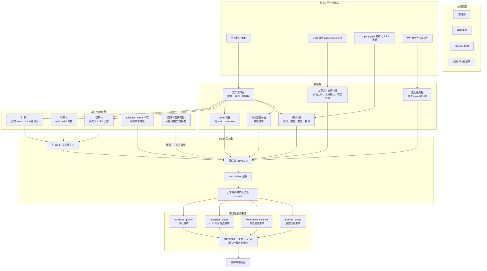
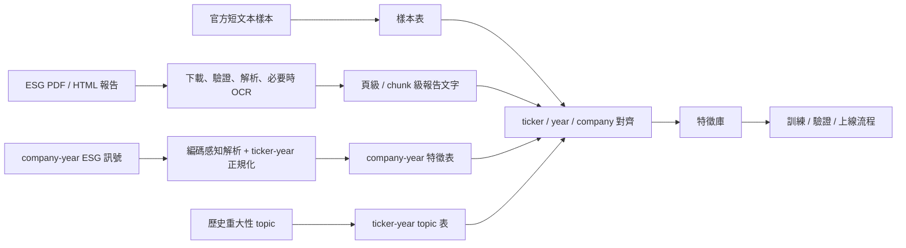
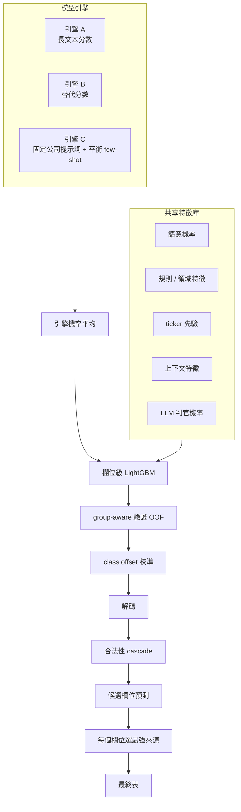
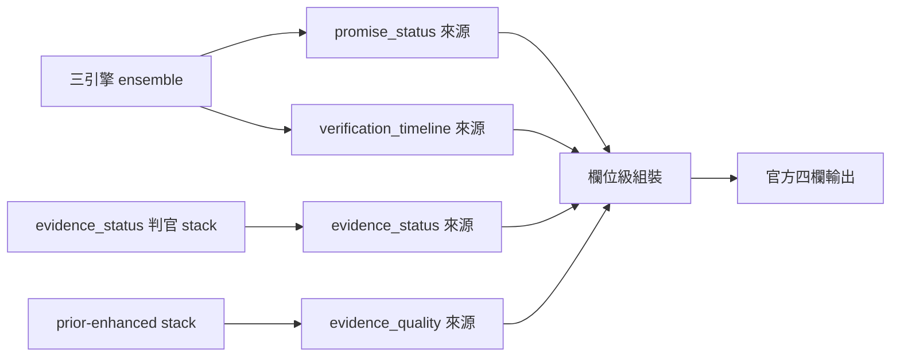
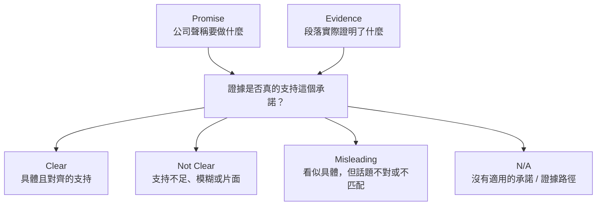
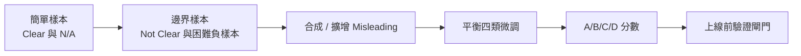
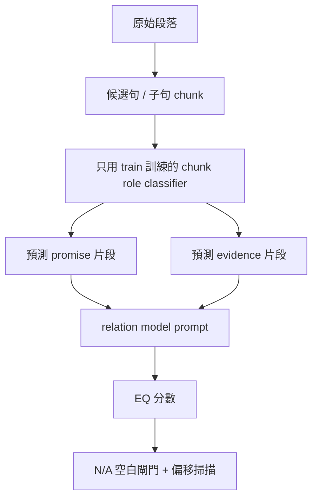
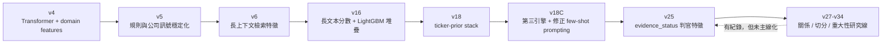

# ESG 承諾驗證競賽架構

這個 repository 只公開架構層級的內容，是一份 ESG 報告段落分類系統的
公開摘要。

文件會整理建模設計、資料流思路、特徵分層、集成策略、驗證紀律，以及後續
研究分支；不包含原始競賽資料、商業資料匯出、模型權重、私有 logits、
生成的提交檔、含答案的 notebook、API keys，或能直接重建提交結果的腳本。

## 中文摘要

這個 repo 只公開架構，不放私人資料、權重、logits 或可直接重建提交檔的腳本。

目前公開可驗證的最佳結果是：

- `submission_v25_evjudge.csv`
- public WS: `0.6060570`

核心做法不是單一大模型直接猜四欄，而是：

1. 先把 ESG 報告原文整理成段落、頁面與 company-year 特徵。
2. 再把文字語意、規則特徵、公司先驗、上下文檢索與 LLM judge 融合成欄位級 stack。
3. 最後只在欄位層級做最佳來源置換，不在欄位置換後重新套 cascade。

你要看的中文架構圖在這裡：

- [v18架構圖.md](v18架構圖.md)

這份圖也收了兩條 Qwen3.5 9B LoRA 支線：

- v14: logit calibration / schema alignment
- v27: REL9B `evidence_quality` 專家流

### 資料來源與欄位意義

- 官方競賽資料：`promise_status`、`verification_timeline`、`evidence_status`、`evidence_quality`
- 長文本來源：公司官網、MOPS/TWSE、Yahoo 搜尋與 PDF 解析
- 外部特徵：TEJ 的 company-year ESG / IFRS 資料

欄位定義重點：

- `data` 是模型真正要看的原始段落
- `promise_string` / `evidence_string` 是人工標註 span
- `page_number`、`pdf_url`、`company_source` 用來追溯來源
- `N/A` 代表欄位不適用，不是缺值

## 架構總覽

目前的主線不是單一大模型直接回答四個標籤，而是欄位級 ensemble。
它會把語意模型、規則特徵、長文本上下文、公司先驗、以及 LLM judge
機率融合起來，再為每個欄位挑選最穩定的來源。



## 主要問題

每一筆樣本都要預測四個欄位：

- `promise_status`
- `verification_timeline`
- `evidence_status`
- `evidence_quality`

難點不是一般的主題分類，而是要分清楚：

1. 這段有沒有承諾
2. 承諾有沒有時間軸
3. 有沒有具體執行計畫或證據
4. 證據是不是「真的支持這個承諾」

因此這個任務同時有：

- ESG 詞彙很領域化
- 標籤嚴重不平衡
- 四欄有層級依賴
- `evidence_quality` 本質上是關係判斷，不是單純 keyword overlap
- 長報告雖然有用，但亂加 retrieval noise 反而會傷分數

## 資料架構

私有專案把資料分成幾層，這個公開 repo 只描述設計，不放原始檔。



最重要的設計選擇是「分層」。官方標籤、長報告上下文、公司結構化
訊號、以及 topic 先驗都不直接混在原始資料裡，而是先正規化成特徵表，
再進模型 stack。

## 模型層

### 1. 語意分支

中文 transformer 分支負責每個欄位的語意機率，處理段落層級的理解：
承諾用語、完成用語、模糊未來式、以及看起來像證據的句子。

### 2. 規則特徵分支

規則特徵用來描述人類容易定義、但小模型容易漏掉的訊號：

- 年份與未來期限
- 百分比、數量、金額、KPI 單位
- 查證、驗證、ISO、GRI、TCFD、稽核訊號
- 模糊動詞 vs. 可量化動作
- 表格感與數字密度

這些特徵不是手寫分類器，而是 fusion model 的輸入。

### 3. 上下文與檢索分支

完整 ESG 報告會被切成 page-level 與 chunk-level 文字。檢索特徵用來
估計某段文字是不是靠近更強的支持上下文。

這條分支只有在訊號夠 field-specific 時才有價值。把一個泛用檢索特徵
硬加到所有欄位，反而容易稀釋原本 stack，所以檢索在這裡是受控的
特徵來源。

### 4. 公司先驗分支

競賽樣本在 train / val / test 之間會共享公司 identity，因此系統使用
平滑後的 company prior：

```text
P(label | ticker) + log(company_sample_count)
```

驗證時的 prior 只由 training labels 算出；部署時才可以用所有可用的
開發階段標籤。這樣既保留合法部署條件，也避免驗證集標籤洩漏。

### 5. LLM 分數 / 判官分支

LLM 在這裡是結構化特徵產生器，不是唯一的最終決策者。

實驗過兩種風格：

- 長文本引擎：直接輸出各欄位選項機率
- 判別器模型：回答更窄的問題，例如「這段證據有沒有支持承諾」

最後被正式接進主線的是 `evidence_status` 判別器。它只作為一個
機率特徵，而不是直接覆蓋答案。

## 集成邏輯



公開評估已確認四個欄位是獨立計分的，所以最後採用欄位級組裝：
每個欄位只保留最強來源，且不在欄位置換後重新套 cascade。否則強欄位
可能被弱欄位拖掉。

## 欄位級策略



這是專案最重要的結論：一旦確認欄位彼此獨立，就可以一個欄位一個欄位
地升級，而不必整體重做。更好的 `evidence_status` 不需要動 `promise`、
`timeline` 或 `evidence_quality`。

## `evidence_quality` 為什麼最難

`evidence_quality` 的問題不是「文字不夠清楚」而已，而是關係判斷：



幾條看起來合理、但最後沒有過 gate 的方向包括：

- 直接 EQ 專家
- Clear / Not Clear 的二元校準
- 泛用 RAG label distribution
- 本地 9B rubric judge
- 把關係判官直接拿來覆寫答案
- 偽切分關係訓練
- 大範圍 materiality 特徵

結論不是「LLM 沒用」，而是這個資料集需要高品質的 promise/evidence
split 與 relation-contrastive supervision。一般四分類訓練大多只會學到
cascade 和多數類捷徑。

## REL9B 研究線

9B relation model 這條線是為了訓練一個專門的
承諾-證據關係判官，官方四類是：

- Clear
- Not Clear
- Misleading
- N/A

訓練時用了 curriculum 的概念：



這條線有研究價值，但沒有直接上線，因為在 test 沒有 gold
`promise_string` / `evidence_string` 的情況下，驗證增益不夠穩。

## 自動切分研究

因為 test 不提供 gold promise / evidence strings，所以做了一個切分器
probe，試著從原始段落推回來。



這個 probe 告訴我們：這個想法不是不行，但關鍵瓶頸在 empty gate。
如果某筆沒有適用的 promise / evidence，必須先保持空白，再交給 relation
model。沒有這一層，切分器會自己亂生片段，N/A recall 直接崩掉。

## Materiality 特徵線

歷史重大性 topic 也曾拿來當 company-topic prior：

- 段落文字與歷史重大性項目的 topic similarity
- E / S / G topic share
- 時間新鮮度與 topic 重要度統計

這條線有廣泛的 ticker coverage，但大多只是重複 company prior 的資訊。
它適合當低風險 feature bank，不適合當突破點。

## 驗證紀律

這個專案採用很嚴的 promotion gate：

- 每一個新特徵都要在 grouped validation 上贏過既有 stack
- 優先接受欄位級增益，而不是大而雜的改動
- 用公開回饋驗證架構，不用人工改答案
- 過不了 gate 的分支會記錄下來並停止
- 最終組裝時，保留每個欄位目前最強的來源

這很重要，因為很多看起來很漂亮的點子，常常只是在 local 有增益，
但 transfer 會失敗：

- 重複 ticker prior 的檢索 label distribution
- 幫到一欄卻污染其他欄的 context feature
- 直接 relation-model 覆寫
- 大範圍 EQ recalibration
- 把 materiality 當 full-stack 加成

## 版本演進



## 為什麼不是端到端大型語言模型

這個任務的特性是：label 固定、資料少、類別不平衡嚴重，而且要做
欄位級評分。純生成式模型會遇到：

- 輸出格式不穩
- 推論成本高
- 少數類校準差
- cascade 規則與 relation judgment 很難分開
- validation 與 test 的 prompt 輸入不同時，轉移不穩

所以最後的架構把 LLM 放在它最擅長的位置：
先產出窄問題的校準機率，再交給小型 supervised stack 決定要信多少。

## 產品化視角

如果未來要做成系統，大概會拆成這些服務：

- ingestion service：解析 ESG 報告並正規化段落
- feature service：產生語意、規則、上下文與 company-prior 特徵
- judge service：處理難的子問題
- inference service：跑欄位級 stack 與校準
- review service：把不確定或關係很強的樣本交給人工審核
- evaluation service：追蹤欄位 F1、drift、錯誤型態

## 公開邊界

這個 repo 只公開：

- 架構圖
- 版本理由
- 模型取捨
- 失敗分析
- 隱私與洩漏邊界

不公開：

- 原始競賽資料
- 解析後的 ESG 報告全文
- 商業或授權資料
- 重大性表與公司級私有特徵檔
- 訓練 checkpoint 與 adapter
- 私有分數、OOF 表、提交檔
- API credentials
- 直接重建私有 submission 的腳本

公開目標是展示工程結構與學習路徑，而不是公開私人競賽資產。
