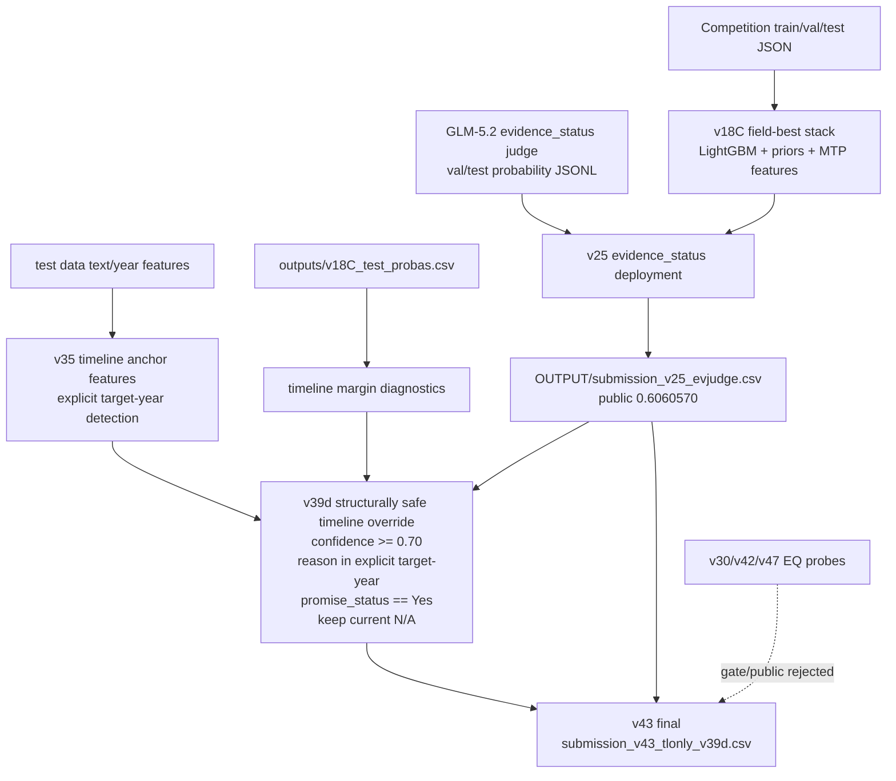

# v43 Pipeline Architecture

## Summary

`v43` was selected as the final private-counting submission because later EQ/LLM probes did not pass the validation gate or public leaderboard check. It keeps the stable v25 base and applies only the timeline improvement that public probing showed to be beneficial.

Final score:

- Private WS: `0.6457201`
- Rank: `6/143`
- File: `submission_v43_tlonly_v39d.csv`

## Pipeline Diagram



The Word/PDF report also embeds generated PNG diagrams from `figures/` so the
architecture is visible without Mermaid rendering:

- `figures/v43_pipeline_overview.png`: full data -> feature/logit -> stack -> v43 flow
- `figures/v43_field_transplant.png`: field-level sources and final v43 assembly
- `figures/v43_validation_gate.png`: deployment gate and rejected branches
- `figures/full_algorithm_layer_map.png`: public-GitHub-aligned algorithm layer map, covering data normalization, feature engineering, LLM/logit features, LightGBM stacking, calibration, and deployment gate

## Final Assembly

The final deterministic formula is:

```text
submission_v43_tlonly_v39d.csv =
    submission_v25_evjudge.csv
    with verification_timeline copied from
    submission_v39d_timeline_explicit_year_tau070_structsafe.csv
```

Only `verification_timeline` changes versus v25:

| Field | Changed cells |
|---|---:|
| `promise_status` | 0 |
| `verification_timeline` | 57 |
| `evidence_status` | 0 |
| `evidence_quality` | 0 |

## v39d Timeline Rule

Starting from `submission_v25_evjudge.csv`, a test row's `verification_timeline` is replaced by the anchor prediction only when all conditions hold:

- `anchor_pred` is one of the valid timeline labels
- `anchor_confidence >= 0.70`
- `anchor_pred != current verification_timeline`
- `anchor_reason in {explicit_target_year, explicit_target_year_range}`
- base `promise_status == Yes`
- current `verification_timeline != N/A`

The last two constraints are the structural safety guard. They prevent the timeline probe from breaking the cascade structure around rows with no promise or no applicable timeline.

## Why Later Probes Were Not Used

The final-day EQ/LLM candidates were intentionally evaluated as separate single-field probes. They were not merged unless their gain was clear. The final selection used the timeline-only probe because:

- EQ probe variants changed 224+ cells and were high risk.
- 27B EQ gate failed against the v25 incumbent.
- v43's private leaderboard result confirmed the fieldwise strategy.

## Reproduction Levels

### Level 1: Final CSV Reproduction

Use:

```bash
python scripts/reproduce_v43.py --root "/path/to/ESG競賽"
```

This reproduces the submitted CSV from two deterministic artifacts:

- `OUTPUT/submission_v25_evjudge.csv`
- `OUTPUT/submission_v39d_timeline_explicit_year_tau070_structsafe.csv`

### Level 2: v39d Rebuild

Use:

```bash
python scripts/build_v39d_timeline.py --root "/path/to/ESG競賽"
python scripts/reproduce_v43.py --root "/path/to/ESG競賽"
```

This rebuilds the timeline source using:

- `esg_competition/data/v35_timeline_anchor_features_test.csv`
- `esg_competition/outputs/v18C_test_probas.csv`

### Level 3: Full Upstream Model Audit

The upstream v25 stack uses historical scripts and artifacts in `esg_competition/` and `HARNESS/`, especially:

- `build_v18_latest.py`
- `build_v18C_engine3.py`
- `build_v25_evjudge_deploy.py`
- `build_v39_lastday_candidates.py`
- `HARNESS/build_v42_v43_orthogonal_probes.py`

Full upstream retraining can be audited from those scripts, but the final submitted file does not require rerunning LLM APIs or model training once v25/v39d artifacts are supplied.
