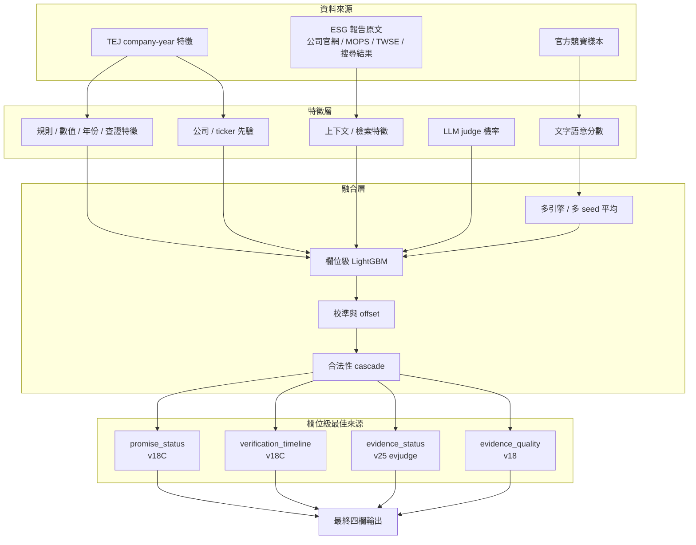
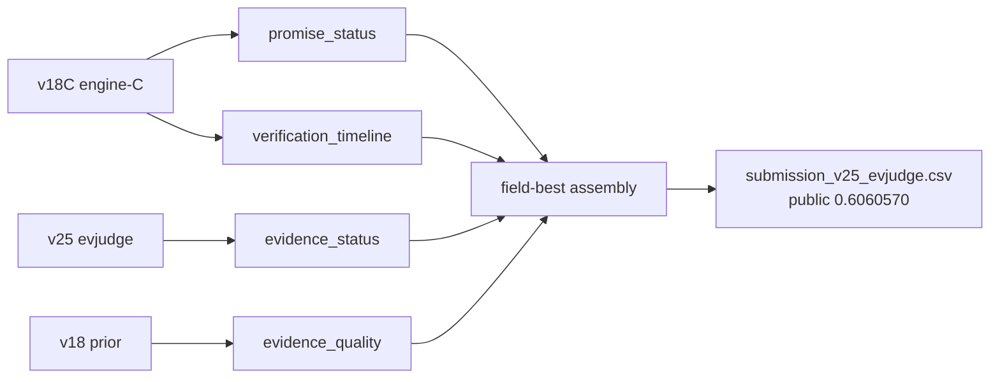
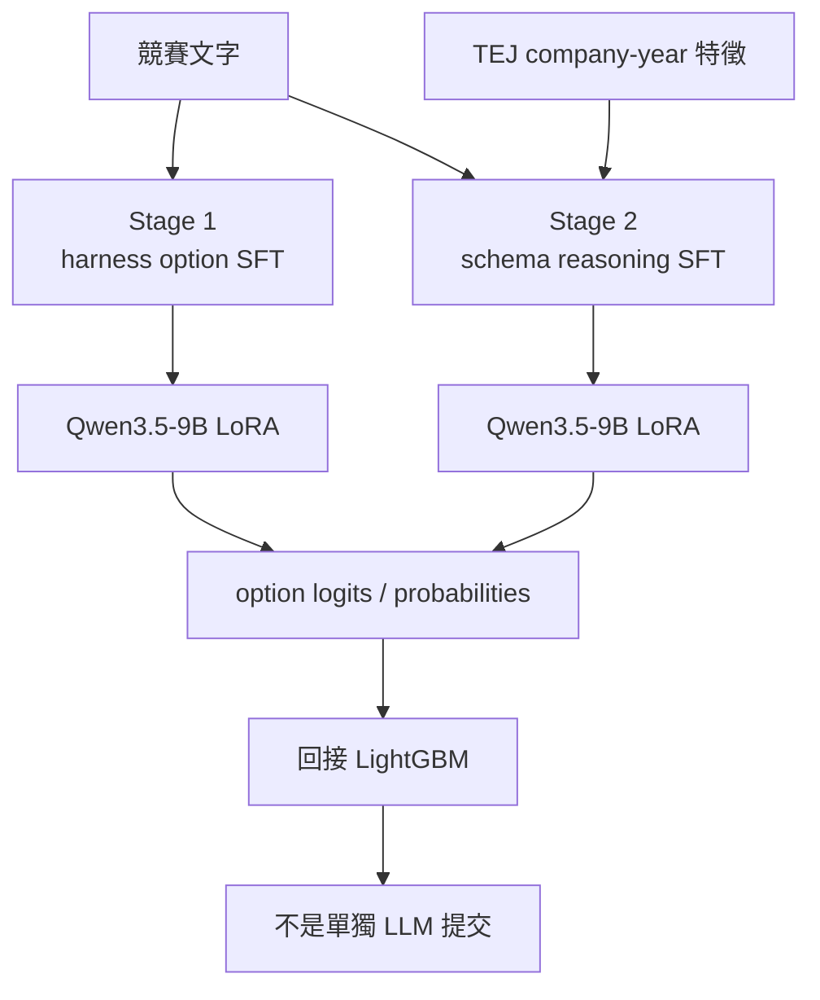
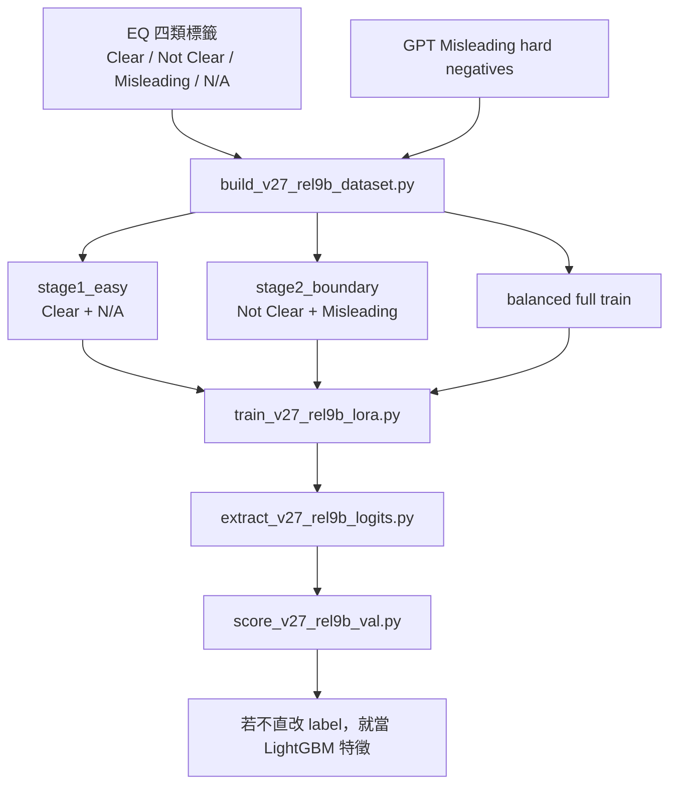

# v18 架構圖

這份文件是 GitHub 上的中文架構說明，重點只放公共可講的設計，不放私人資料、模型權重、submission 產物或可直接重建答案的細節。

## 1. 總體流程

## 2. 欄位意義

| 欄位 | 意義 |
|---|---|
| `promise_status` | 這段是否有明確承諾 |
| `verification_timeline` | 承諾完成時機 |
| `evidence_status` | 是否有具體執行計畫或佐證 |
| `evidence_quality` | 證據是否清楚、具體、沒有明顯漂綠風險 |

`N/A` 代表任務不適用，不是缺值。

## 3. 檔案與資料層

| 類別 | 說明 |
|---|---|
| 官方樣本 | 競賽訓練 / 驗證 / 測試資料 |
| 長文本 | 由公司官網、MOPS/TWSE、搜尋結果與 PDF 解析整理而來 |
| TEJ 特徵 | company-year ESG / IFRS 輔助訊號 |
| 中介特徵 | 字詞、數字、年份、上下文、公司先驗、LLM judge |

## 4. 欄位級策略

欄位不是一起修，而是只換贏的欄位：

關鍵原則：

- 欄位獨立評分成立
- 欄位置換後不再重跑 cascade
- 每次只換一個欄位，方便歸因

## 5. 兩條 Qwen3.5 9B LoRA 支線

### v14: logit calibration / schema alignment

用途：

- 把 Qwen3.5-9B 當成校準器，不當最終分類器
- 產出 logits / probabilities 回灌堆疊模型

### v27: REL9B `evidence_quality` 專家流

用途：

- 只處理 `evidence_quality`
- 重點是關係判斷，不是單純字面相似
- 若直接覆寫不穩，就只把機率當特徵

## 6. 為什麼 EQ 是最難的

`evidence_quality` 不是單純的「有沒有證據」。

真正難的是：

- evidence 是否真的支持 promise
- 是否只是看起來像證據，但其實話題不一致
- 是否只有政策口號，沒有數字 / 時間 / 結果

所以這條線最後保留成：

- 保守堆疊
- 只做欄位級替換
- 不對欄位做 cascade 二次傷害

## 7. 公開邊界

這個 repo 只公開：

- 架構圖
- 設計理由
- 失敗原因
- 公開 best score

不公開：

- 原始競賽資料
- 私人 TEJ / 中介特徵檔
- 權重與 logits
- 直接重建 submission 的腳本

