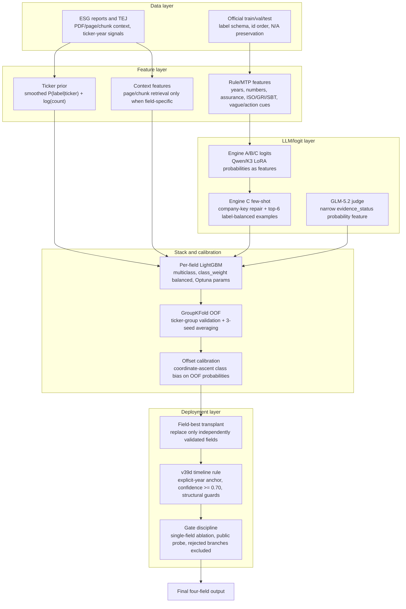

# v43 最終架構

這份文件補充最終 private-counting submission 的架構說明。公開範圍仍只包含方法、架構與演算法層，不包含原始資料、submission CSV、模型權重、私有 logits、API 輸出或可直接重建答案的腳本。

最終結果：

- Private weighted score: `0.6457201`
- Private rank: `6/143`
- 最終提交概念：`v43 = v25 base + v39d timeline-only override`

## 1. 為什麼不能只說 v43

v43 本身看起來像欄位拼接，但它不是整套方法的起點。完整系統先建立 v18/v18C/v25 的欄位級 stack，再用最後一天通過 gate 的 v39d timeline 分支做小幅替換。

也就是說：

```text
raw data / ESG reports / company-year signals
  -> feature and LLM-logit bank
  -> v18 prior-enhanced LightGBM stack
  -> v18C third-engine ensemble
  -> v25 evidence_status judge deployment
  -> v39d explicit-year timeline probe
  -> v43 final field-level assembly
```

## 2. 完整演算法層



## 3. 主要演算法結構

| 層級 | 演算法 / 方法 | 用途 |
|---|---|---|
| Data normalization | deterministic JSON/CSV normalization, id sorting, `N/A` preservation | 保持官方格式與欄位語意穩定 |
| Domain features | rule/MTP feature extraction | 把年份、數字、查證、標準、行動詞與模糊詞轉成 tabular features |
| Company-year features | TEJ / ESG company-year join | 加入公司年度可觀測訊號 |
| Ticker prior | empirical-Bayes smoothed `P(label|ticker) + log(count)` | 捕捉同公司標籤穩定性；validation 用 train-only prior，test 用 train+val prior |
| LLM logits | Qwen/K3 LoRA option logits and Engine A/B/C scores | 作為 LightGBM 的語意機率特徵，不直接當最終答案 |
| Few-shot Engine C | company prompt repair + top-6 label-balanced retrieval | 增加和 A/B 不同的長文本判斷訊號 |
| Stack | per-field LightGBM multiclass, class_weight balanced, GroupKFold OOF, 3 seeds | 每個欄位獨立融合多種特徵 |
| Calibration | coordinate-ascent class offsets | 在 OOF 機率上調整類別偏置以優化 macro-F1/weighted score |
| Cascade | normal decode applies hierarchy; field transplant does not rerun cascade | 保持合法輸出，同時保護已驗證的欄位增益 |
| Deployment gate | single-field ablation + public probe | 只部署通過風險/收益檢查的欄位改動 |

## 4. 版本到演算法的對應

| Version | 主要算法結構 | 角色 |
|---|---|---|
| v18 | Engine A/B logits + MTP/TEJ/BERT/v6.3 features + ticker prior + LightGBM stack | prior-enhanced base stack |
| v18C | v18 + Engine C few-shot logits + A/B/C multi-engine ensemble | 強化 promise_status 與 verification_timeline |
| v25 | v18C field-best + GLM-5.2 evidence_status judge probability feature | 改善 evidence_status |
| v39d | explicit target-year timeline anchor with structural safety guards | 改善 verification_timeline |
| v43 | v25 base + only verification_timeline from v39d | final private-counting field-level assembly |

## 5. v43 欄位來源

| 欄位 | 最終來源 | 演算法理由 |
|---|---|---|
| `promise_status` | v18C | A/B/C 長文本 logits + LightGBM stack 在此欄位較穩 |
| `verification_timeline` | v39d over v25 | explicit-year anchor 對 timeline 是低風險強訊號 |
| `evidence_status` | v25 | GLM-5.2 narrow judge probability 特徵對此欄位有正增益 |
| `evidence_quality` | v18/v18C incumbent | EQ 關係判斷分支未通過 gate，保留保守 stack |

## 6. 為什麼保留 evidence_quality incumbent

`evidence_quality` 本質上是 promise-evidence relation judgment，不是單純 keyword matching。多個方向都測過但未進 final：

- generic RAG label distribution
- EQ binary / rubric judge
- local 9B / REL9B EQ specialist
- frontier relation judges
- Misleading similarity probe
- broad Not Clear calibration

這些支線要嘛和 ticker prior 重複，要嘛 local validation 或 public probe 不穩。最後選擇保留 incumbent EQ，讓 final 只吃 timeline 的確定增益。

## 7. 公開邊界

公開 repo 只說明：

- 演算法架構
- 特徵分層
- LLM 如何作為 feature / judge
- 欄位級 deployment gate
- 為什麼 v43 是最後選擇

不公開：

- 官方資料與私有標註
- ESG 報告全文與 TEJ 原始檔
- submission CSV
- 模型權重、LoRA adapter、私有 logits
- API 回應 JSONL
- 可直接重建 final submission 的腳本
